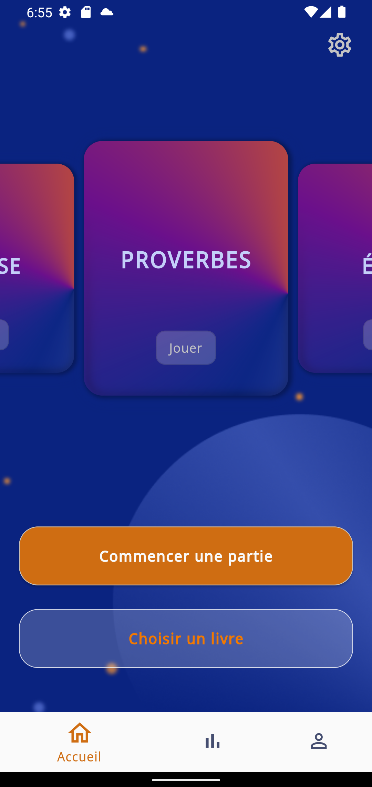
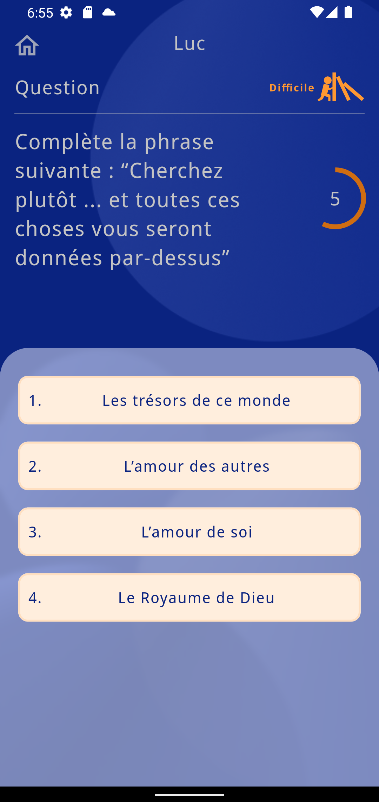
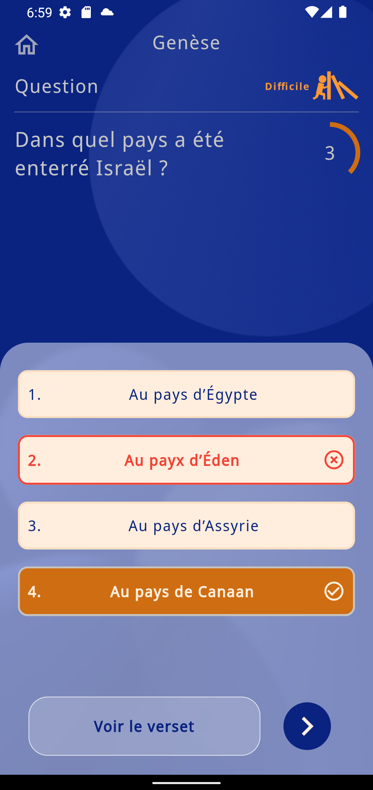

# About Gypse Quiz App

Quiz app to challenge your knowledge about bible with 3 modes of difficulty.

Design by  <a href="https://www.linkedin.com/in/sia-xiong-aa88091b9/">Sia Xiong</a>.

## Getting Started

To get a local copy up and running follow these simple steps.

### Prerequisites

you need a complete version of flutter installed on your computer and an emulator of ios or android device.

### Install
Clone this repo : https://github.com/menel972/gypse-app.git

run :

$ flutter pub get

$ flutter run
